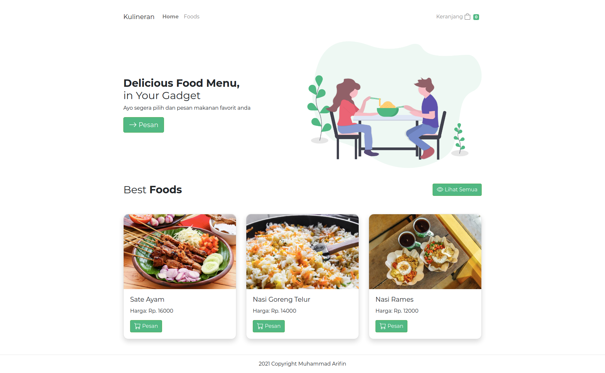

# kulineran

A minimalist and responsive food ordering application built using Vue and Bootstrap



## Project setup

```
npm install
```

### Compiles and hot-reloads for development

```
npm run serve
```

### Run the fake REST API

- cd `src/db`
- run `json-server --watch db.json` on the terminal.

### Compiles and minifies for production

```
npm run build
```
